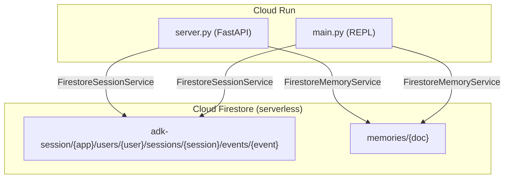
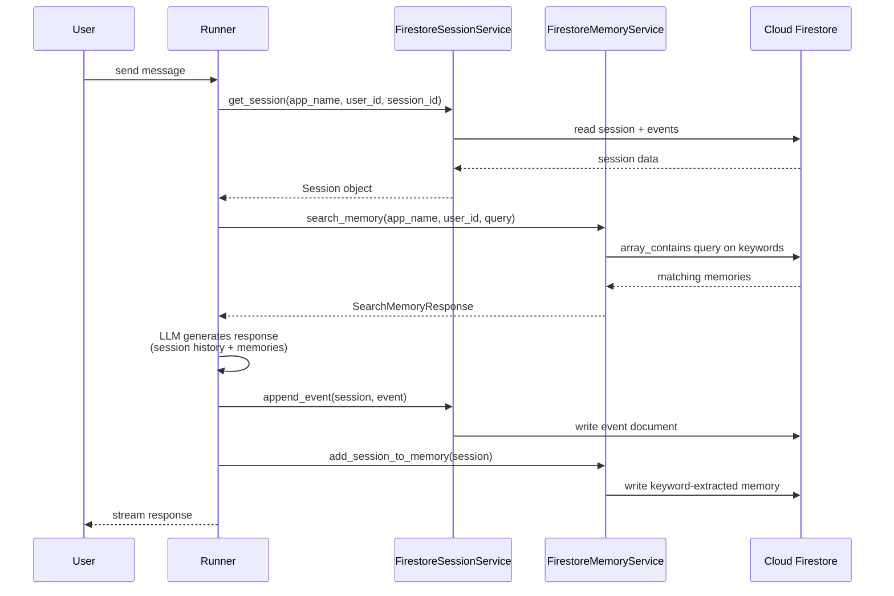

# Plan: Persistent Session & Memory for GEAP ADK Agents

Add persistent session history and long-term memory to the GEAP ADK agents using **Cloud Firestore** — serverless, no ReasoningEngine needed, works natively with Cloud Run.

---

## 1. Current Architecture

```
┌─────────────────────────────────────────────────────────┐
│                     Cloud Run                           │
│  ┌──────────────────┐   ┌────────────────────────────┐  │
│  │   server.py      │   │  main.py (REPL)           │  │
│  │                  │   │                            │  │
│  │ VertexAiSession  │   │ InMemorySessionService     │  │
│  │ VertexAiMemory   │   │ No memory service          │  │
│  │                  │   │                            │  │
│  │ Requires:        │   │ Volatile — lost on restart │  │
│  │ • ReasoningEngine│   │                            │  │
│  │ • AGENT_ENGINE_ID│   │                            │  │
│  └──────────────────┘   └────────────────────────────┘  │
└─────────────────────────────────────────────────────────┘
```

**Problems:**
- `server.py` requires a Vertex AI ReasoningEngine resource (extra GCP resource to create and manage)
- `main.py` — sessions and memory vanish on restart
- No shared persistence between the two entry points

---

## 2. Target Architecture



Both entry points share the same Firestore collections — sessions and memories persist across restarts and are accessible from any replica.

---

## 3. Data Model

### Session Storage — `FirestoreSessionService` (ADK built-in)

**Collection hierarchy** (auto-managed):

```
adk-session/                          # root_collection (configurable)
  └── geap/                           # app_name
       └── users/
            └── {user_id}/
                 └── sessions/
                      └── {session_id}/
                           └── events/
                                └── {event_id}
```

Separate top-level collections for app/user state:

```
app_states/{app_name}
user_states/{app_name}/users/{user_id}
```

No custom code needed — `FirestoreSessionService` manages all of it.

### Memory Storage — `FirestoreMemoryService` (ADK built-in)

**Collection:** `memories` (configurable via constructor)

**Document fields** (auto-generated):

| Field | Type | Description |
|-------|------|-------------|
| `appName` | string | Namespace |
| `userId` | string | User scope |
| `keywords` | string[] | Extracted keywords (stop words removed) |
| `author` | string | Who generated the content |
| `content` | string | Serialized content text |
| `timestamp` | Timestamp | When the memory was created |

**Search:** Keyword matching via Firestore's `array_contains` filter — fast, server-side, no client-side filtering needed.

---

## 4. Services Comparison

| Service | Session persistence | Memory persistence | Requires |
|---------|-------------------|-------------------|----------|
| **`Firestore services`** ← **USE THIS** | ✅ | ✅ | Firestore database (one `gcloud` command) |
| `VertexAiSessionService` + `VertexAiMemoryBankService` | ✅ | ✅ | ReasoningEngine resource + AGENT_ENGINE_ID |
| `InMemorySessionService` + `InMemoryMemoryService` | ❌ | ❌ | Nothing (current REPL) |

**Why Firestore wins:**
- Serverless — no provisioning, scales to zero, no idle cost
- Works natively with Cloud Run — same GCP project, no VPC connector
- Both services already ship in the ADK — zero custom code
- No ReasoningEngine to create or env vars to configure
- Session and memory survive restarts and scale across replicas

---

## 5. Implementation

### Changes per file

| File | Action |
|------|--------|
| `geap_agent/server.py` | **Modify** — replace Vertex AI imports + services with Firestore services |
| `geap_agent/main.py` | **Modify** — replace InMemorySessionService with Firestore services |
| `geap_agent/requirements.txt` | **Modify** — add `google-cloud-firestore` |

### `server.py` changes

**Remove:**
```python
from google.adk.memory.vertex_ai_memory_bank_service import VertexAiMemoryBankService
from google.adk.sessions.vertex_ai_session_service import VertexAiSessionService
# and all their setup code...
```

**Add:**
```python
from google.adk.integrations.firestore import (
    FirestoreSessionService,
    FirestoreMemoryService,
)

session_service = FirestoreSessionService()
memory_service = FirestoreMemoryService()
```

**Remove env vars:**
```
GOOGLE_CLOUD_PROJECT          ← no longer needed by service constructors
GOOGLE_CLOUD_LOCATION         ← no longer needed
AGENT_ENGINE_ID               ← no longer needed
```

The `GOOGLE_GENAI_USE_VERTEXAI` and `GOOGLE_CLOUD_STAGING_BUCKET` vars may still be needed for the LLM calls within the agents (they use Vertex AI's Gemini endpoint), but the session/memory services no longer need them.

### `main.py` changes

**Remove:**
```python
from google.adk.sessions.in_memory_session_service import InMemorySessionService
```

**Add:**
```python
from google.adk.integrations.firestore import FirestoreSessionService
from geap_agent.services.sqlite_memory_service import SqliteMemoryService  # ← actually, use FirestoreMemoryService
```

Wait — the REPL should also use Firestore for consistency. Both entry points should share the same persistence layer.

```python
from google.adk.integrations.firestore import (
    FirestoreSessionService,
    FirestoreMemoryService,
)

session_service = FirestoreSessionService()
memory_service = FirestoreMemoryService()
```

### `requirements.txt` changes

```
google-cloud-firestore
```

---

## 6. Prerequisites (one-time setup)

```bash
# 1. Create a Firestore database in your GCP project
gcloud firestore databases create --location=us-west1

# 2. Install the Python dependency
pip install google-cloud-firestore

# 3. Authenticate (for local dev)
gcloud auth application-default login

# On Cloud Run: the default service account handles auth automatically
```

---

## 7. Architecture Flow



---

## 8. Edge Cases

| Scenario | Behavior |
|----------|----------|
| Firestore not created in project | `FirestoreSessionService` init fails — clear error from Firestore client |
| No ADC credentials | Firestore client raises auth error at first operation |
| Multiple Cloud Run replicas | Firestore handles concurrent writes via transactions + optimistic concurrency — no conflicts |
| Session doesn't exist | `get_session` returns `None`; `create_session` is called automatically by `Runner` with `auto_create_session=True` |
| Memory memory search with no matches | Returns empty `SearchMemoryResponse(memories=[])` |
| Events with no text (function calls only) | Filtered out by `FirestoreMemoryService._extract_keywords` — no empty memories created |
| Large session with thousands of events | `add_session_to_memory` commits in batches of 500 documents |
| Concurrent append to same session | Per-session `asyncio.Lock` + Firestore transaction with revision check — stale writers get `ValueError` |
