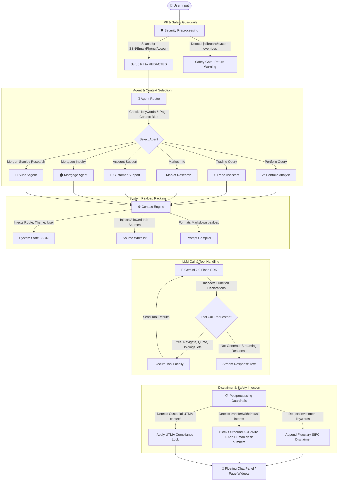

# GEAP E*TRADE POC — Master System Documentation

This document provides a comprehensive overview of the **Gemini Enterprise Agent Platform (GEAP) E*TRADE Proof-of-Concept** system architecture, tech stack, active features, multi-agent fleet configuration, and security guardrails.

---

## 1. System Architecture Flow

The workspace coordinates user queries, application state, local tool executions, and external LLM connections. Below is the system flow map:

---

## 2. Technical Stack

The proof of concept is constructed as a modern, framework-free single-page web application designed for low latency, zero build step overhead, and ease of audit.

### Backend (Node.js & Express)
* **Runtime**: [Node.js](https://nodejs.org/) utilizing [Express](https://expressjs.com/) to serve static assets and handle routing fallback for deep linking.
* **Session Management**: `express-session` handles server-side user sessions and connects OAuth access tokens to unique browser sessions.
* **Authentication**: Out-of-band OAuth 1.0a flow connecting to the **E\*TRADE Developer API Sandbox** (using `oauth-1.0a` and `crypto` for HMAC-SHA1 signature calculations).
* **Search Proxy**: Proxies query calls to Google News RSS feeds (`/api/search`) to bypass CORS and serve live articles from Bloomberg, Reuters, Morningstar, and Yahoo Finance in JSON format.
* **CSS Minifier**: Native startup logic in [server.js](file:///Users/klejnieks/Graveyard/GEAP/server.js) that scans the stylesheet folder on start and minifies raw files into `.min.css` dynamically.
* **Audit Logs**: Redirects `console.log` and `console.error` to a persistent local log at [server.log](file:///Users/klejnieks/Graveyard/GEAP/server.log).

### Frontend (Vanilla JS SPA)
* **Single Page Shell**: Framework-free rendering in [index.html](file:///Users/klejnieks/Graveyard/GEAP/public/index.html) controlled by [app.js](file:///Users/klejnieks/Graveyard/GEAP/public/js/app.js).
* **Navigation Router**: vanilla JavaScript router mapping path hooks to dedicated module renderers (preserving the app shell headers and side rails).
* **Chart Rendering**: Fully custom inline SVG generators and canvas layouts (e.g. sparklines, donut distribution allocation grids, retirement projection curves).
* **Theme Styling**: Clean HSL custom CSS system featuring modern typographic scales, responsive layouts, micro-animations, glassmorphism overlays, and a dark mode aesthetic tailored to the E\*TRADE look and feel.

---

## 3. Core Modules & Engine Components

The functionality is split across modular client-side engines:

### A. Unified Context Engine ([context.js](file:///Users/klejnieks/Graveyard/GEAP/public/js/context.js))
Dynamically constructs JSON/Markdown payload representations of the application state for each agent request:
1. **Platform Details**: Active route, system timestamp, visual theme.
2. **User Profiles**: Account name, last login timestamp.
3. **Selected Account Context**: Account ID, net asset value, settled buying power cash.
4. **Security Governance**: Boolean status of PII scrubbing, safety overrides, and disclaimer toggles.
5. **AI Source Policies**: Allowed public/private source whitelists (`yahoo`, `sec`, `bloomberg`, `reuters`, `morningstar`, `private_holdings`, `private_transactions`, `private_tax`) and access level permissions (e.g., Read-Only vs Read-Write).

### B. Gemini API Integration ([gemini.js](file:///Users/klejnieks/Graveyard/GEAP/public/js/gemini.js))
Direct connector to Google Gemini 2.0 Flash (`gemini-2.5-flash`):
1. **Dynamic Import**: Loads the official `@google/genai` SDK from `esm.run` at runtime when an API key is entered.
2. **Streaming Execution**: Initiates stream content chunks using `ai.models.generateContentStream` to stream text responses to the UI in real time.
3. **Recursive Tool Calling**: Declares function definitions and recursively resolves `functionCall` objects by executing local JS tools and pushing responses back into the prompt stream context.

### C. Multi-Agent Fleet Manager ([agents.js](file:///Users/klejnieks/Graveyard/GEAP/public/js/agents.js))
Houses configurations, system instructions, tool bounds, and routing behaviors. It defines 6 specialized agents:

1. **Portfolio Analyst**: Evaluates holdings, weights, diversification, rebalancing opportunities, and tax-loss harvesting candidates.
2. **Trade Assistant**: Guides order types, stock quotes, margins, position sizing risk warnings.
3. **Market Research**: Explains economic metrics, S&P trends, equity bull/bear outlooks.
4. **Customer Support**: Handles platform navigation tutorials, account transfers, fees, tax document retrieval FAQ paths.
5. **Market Research Super Agent**: Advanced analyst utilizing Morgan Stanley Research, crypto/ETFs, commodities (gold), and private equity.
6. **Mortgage Agent**: Guides Jumbo loan guidelines (MS Jumbo vs Rocket partner referral limits), HELOC eligibility, location/timeline inputs.

#### Intent Routing Engine (`autoRoute`)
Analyzes query text using score metrics:
* **Keyword Density**: Scores matches against core lists (e.g., "rebalance" -> Portfolio, "limit order" -> Trade).
* **Page Route Bias**: Shifts routing weight depending on the SPA page the user is viewing (e.g. browsing `/trading` tilts auto-routing toward the Trade Assistant).
* **Model Configuration**: Exposes dynamic interfaces for custom agent creation (`registerAgent`) and decommissioning (`deregisterAgent`) at runtime.

---

## 4. UI Surfaces & Features

| View Page / Component | URL Path | Key Functions & Features |
| :--- | :--- | :--- |
| **Complete View Dashboard** | `/accounts` | Asset totals, days gain, interactive account cards (main brokerage, custodial, stock plans, private checking), alerts panel, watchlist snapshot, top portfolio movers, sector breakdown pie. |
| **Portfolios Visualizer** | `/accounts/portfolios` | Performance history charts, holdings table, sector vs asset allocation tab toggles, canvas asset distribution donut chart. |
| **Planning & Retirement** | `/planning` | Interactive retirement health-check button, success rate gauges, Monte Carlo projection charts, active safeguards status cards. |
| **AI Insights Hub** | `/ai-insights` | Dedicated advisory feed cards, interactive **What-If Scenario Sandbox** simulating trade transaction impact (buying power checks, weight shift deltas, portfolio beta changes). |
| **Agent Studio** | `/agent-studio` | Visual node flow routing map, prompt customization playground, temperature sliders, model selectors, live test console, dynamic agent creator modal. |
| **Agent Fabric Monitor** | `/agent-fabric` | Real-time system performance monitors (latency, requests, tokens, success rates), live activity audit log rows, active routing visual mapping, governance toggle switches. |
| **AI Settings** | `/ai-settings` | Governance panel allowing users to toggle whitelisted news sources (Bloomberg, Reuters, Morningstar, etc.) and switch between Read-Write or Read-Only agent modes. |
| **Floating Chat Assistant** | *Sidebar panel* | Floating side overlay supporting manual agent overrides, auto-routing chips, suggestion chips tailored to active routes, markdown rendering, and provenance inspector details. |

---

## 5. Security, Privacy & Compliance Guardrails

The platform embeds multi-layered compliance guardrails directly into the transaction processing pipeline:

### A. Privacy Shield (PII Scrubber)
Intercepts user queries client-side before sending data to the LLM. It scans for patterns matching:
* **Social Security Numbers**: Redacted to `[REDACTED SSN]`.
* **Account Numbers**: Redacted to `[REDACTED ACCOUNT]`.
* **Email Addresses**: Redacted to `[REDACTED EMAIL]`.
* **Phone Numbers**: Redacted to `[REDACTED PHONE]`.
A diagnostic message is added to the UI chat stream whenever PII is scrubbed.

### B. Content Safety Gate
Blocks prompt injections, jailbreaks, and system override instructions (`"ignore prior instructions"`, `"override prompt"`) when the Content Safety rule is enabled in the Agent Fabric toggles.

### C. Fiduciary Disclosures
Checks responses for investment terminology (e.g. portfolio, stock, shares, rebalance). If detected, it automatically appends a Morgan Stanley Smith Barney SIPC investment risk disclaimer.

### D. UTMA Custodial Protections
Identifies the active account context. If the user is viewing the UTMA minor custodial account:
* Outbound cash transfers and asset withdrawal tools are blocked.
* System returns UTMA compliance warnings noting that UTMA cash belongs irrevocably to the minor.
* Suggests human compliance officer review paths.

### E. Human Handoff / High-Risk Guardrails
Wire transfers or large outbound transactions (e.g., withdrawals above $10,000) are flagged as high risk. The agent:
1. Blocks automatic execution.
2. Stages a draft transfer.
3. Generates a mock callback ticket (e.g., `MS-WIRE-84920`).
4. Directs the user to human wire desk support hotlines.

---

## 6. Verification and Unit Testing

The project maintains a full suite of automated verification suites under [tests](file:///Users/klejnieks/Graveyard/GEAP/tests):
* **Unit Tests**: Coverage for agent auto-routing, transaction data processing, and context engine formatting.
* **Integration Tests**: Tests the Express backend APIs (session saving, proxy news RSS scraping, auth pathways).
* **End-to-End Tests**: Puppeteer script validation simulating chat message runs, checking PII scrubbing compliance, and validating route redirection.
